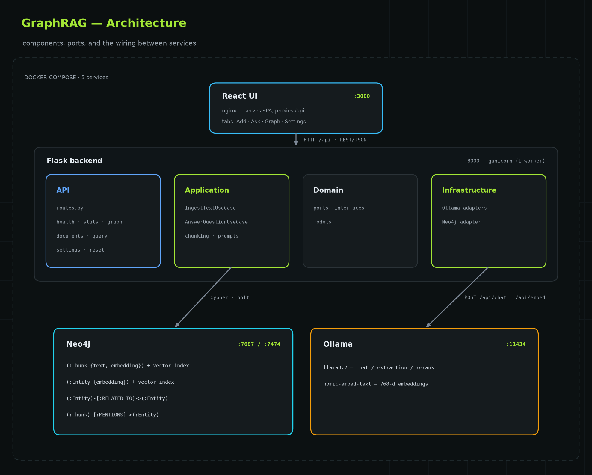
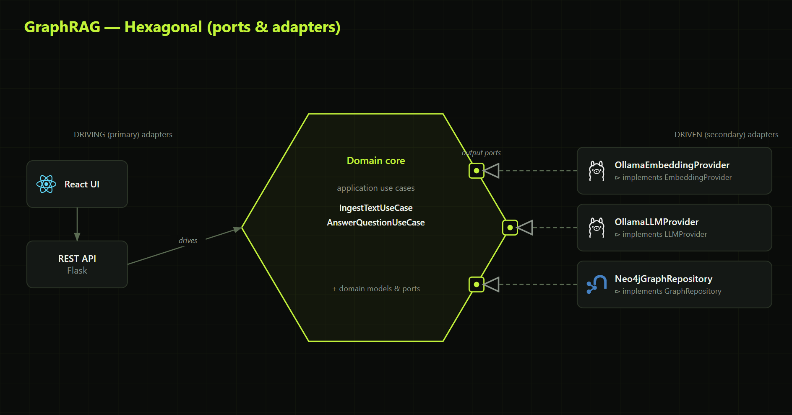
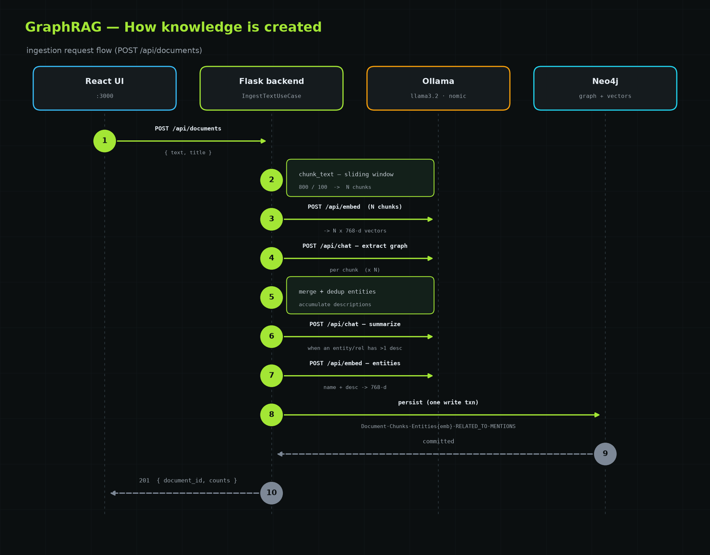
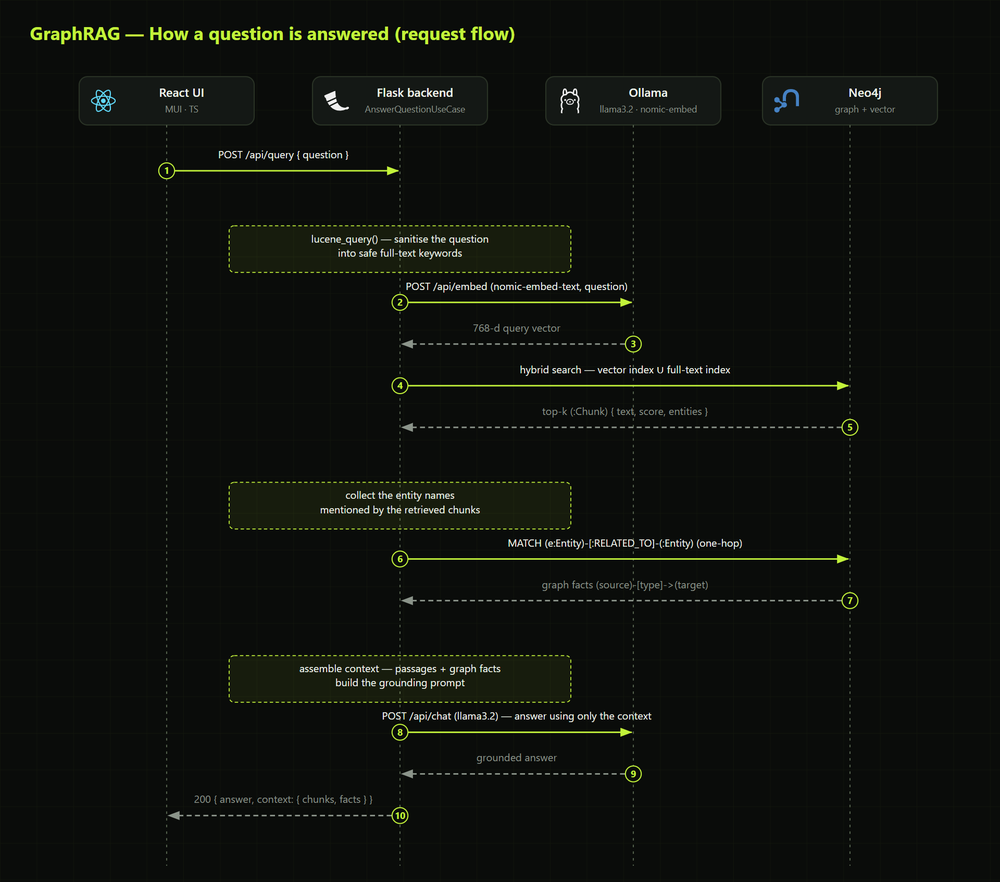

# Local GraphRAG Knowledge Base

> A self‑hosted, **fully offline** GraphRAG system — paste text, build a knowledge graph, ask grounded questions. Nothing ever leaves your machine.

<p align="center">
  
  
  
  
  
  
</p>

Paste any text into the web UI and it's chunked, embedded, and turned into a **knowledge
graph** in Neo4j. Ask a question and a **local LLM (Ollama)** answers it — grounded only in
what you added, using both semantic (vector) search and one‑hop graph expansion.

> **Proof of concept** — the full _ingest → graph → retrieve → answer_ loop, runnable with a
> single `docker compose up`.

---

## The app

A React + Material UI front end with four tabs.

### Add knowledge

Paste any text — it's chunked, embedded, and an entity/relationship graph is extracted into Neo4j.


### Ask

Your question is embedded, matched against stored chunks (hybrid vector + keyword) **and against
entities directly** (entity-anchored "local search"), expanded over the graph, and answered by the
local LLM — with expandable **sources** (passages + graph facts).


_The app starts empty — the answer above is grounded in documents that were ingested first
(the stats bar reflects that). You build the knowledge base with your own text._

### Knowledge graph

Interactive [Cytoscape](https://js.cytoscape.org/) view of the extracted entities (coloured
by type) and their relationships. Drag nodes, scroll to zoom, refresh after ingesting.


### Settings

Live‑tune the RAG pipeline — chunk size / overlap, top‑K, max extraction characters, and the
entity‑extraction toggle. Changes apply immediately.


---

## Quick start

```bash
docker compose up --build
```

| Service       | URL                                             |
| ------------- | ----------------------------------------------- |
| **Web UI**    | http://localhost:3000                           |
| Neo4j Browser | http://localhost:7474 (`neo4j` / `password123`) |
| Backend API   | http://localhost:8000/api/health                |

First run downloads ~2.5 GB of Ollama models — wait for `RAG backend ready.` in the logs,
then open the UI. CPU works; a GPU is much faster (uncomment the `deploy` block for `ollama`
in [docker-compose.yml](docker-compose.yml)).

> **Behind a corporate proxy / antivirus** and the build or model pull fails with SSL
> errors? See [Troubleshooting](#troubleshooting) below.

---

## Architecture

Five services, wired by Docker Compose (a one-shot `ollama-init` pulls the models, then
exits). The Flask backend follows **clean architecture** (dependencies point inward to the
domain). **Neo4j** is both the vector store and the knowledge graph; **Ollama** serves the
local chat and embedding models.

<p align="center"></p>

Internally it's a **ports & adapters** (hexagonal) design: the domain core depends only on
interfaces; the Ollama and Neo4j adapters implement them, so every dependency points inward.

<p align="center"></p>

Deep dive — clean‑architecture rationale, the Neo4j schema, and the GraphRAG sophistication
ladder: **[docs/ARCHITECTURE.md](docs/ARCHITECTURE.md)**.

---

## How it works

Neo4j does double duty: it stores **chunk embeddings** (a native vector index) _and_ an
**entity/relationship graph**. Retrieval is therefore **hybrid** — semantic vector search
finds relevant passages, the query is also matched against **entity embeddings** to find
relevant entities directly, and a one‑hop graph traversal then pulls in connected facts that
plain vector RAG would miss.

### Creating knowledge

`text → chunk → embed (Ollama) → extract + summarize graph per chunk (Ollama) → embed entities → store in Neo4j`

<p align="center"></p>

### Answering a question

`question → embed (Ollama) → hybrid search + LLM rerank → entity & graph expansion → grounded answer (Ollama)`

<p align="center"></p>

---

## Tech stack

| Layer         | Choice                                                       |
| ------------- | ------------------------------------------------------------ |
| Frontend      | React 18 · TypeScript · Vite · Material UI                   |
| Backend       | Python · Flask — clean architecture / modular monolith       |
| Graph DB      | Neo4j 5 (graph + native vector index)                        |
| LLM & embed   | Ollama (`llama3.2`, `nomic-embed-text`) — open source, local |
| Orchestration | Docker Compose                                               |

<details>
<summary><b>Configuration</b></summary>

Env vars set the **startup defaults** (copy [.env.template](.env.template) to `.env`); the
chunking/retrieval ones are then editable at runtime from the **Settings** tab.

| Variable                       | Default            | Meaning                               |
| ------------------------------ | ------------------ | ------------------------------------- |
| `LLM_MODEL`                    | `llama3.2`         | Ollama chat model                     |
| `EMBEDDING_MODEL`              | `nomic-embed-text` | Ollama embedding model                |
| `EMBEDDING_DIM`                | `768`              | Must match the embedding model        |
| `CHUNK_SIZE` / `CHUNK_OVERLAP` | `800` / `100`      | Chunking window (characters)          |
| `TOP_K`                        | `5`                | Chunks retrieved per question         |
| `ENABLE_ENTITY_EXTRACTION`     | `true`             | Off = plain vector RAG, faster ingest |

> Changing `EMBEDDING_MODEL` changes the vector dimension — update `EMBEDDING_DIM` to match
> and reset the knowledge base; old and new vectors aren't comparable.

</details>

<details>
<summary><b>Troubleshooting</b></summary>

**SSL certificate errors behind a TLS-inspecting proxy.** Your host trusts the proxy's
root CA, but the containers don't. Two phases, fixed separately:

1. **Image build** (pip/npm `CERTIFICATE_VERIFY_FAILED`) → set `INSECURE_TLS=1` in `.env`.
2. **Ollama model pull** (`x509: certificate signed by unknown authority`) → Ollama must
   _trust_ the CA. Export your roots into [certs/](certs/):
   ```powershell
   powershell -ExecutionPolicy Bypass -File certs\export-windows-cas.ps1
   ```
   (See [certs/README.md](certs/README.md) for non-Windows.) Then `docker compose up --build`.

On a normal network neither step is needed.

**Backend retries Neo4j on first boot** — expected; Neo4j takes ~30 s to become healthy.

**First question is slow** — the LLM loads into memory on the first call; later calls are
faster (a GPU helps a lot).

</details>

<details>
<summary><b>API reference</b></summary>

| Method | Path             | Body / Query            | Description                           |
| ------ | ---------------- | ----------------------- | ------------------------------------- |
| GET    | `/api/health`    | —                       | Liveness check                        |
| GET    | `/api/stats`     | —                       | Counts of docs/chunks/entities        |
| GET    | `/api/graph`     | `?limit=N`              | Entities + relationships (graph view) |
| GET    | `/api/settings`  | —                       | Current RAG tuning parameters         |
| PUT    | `/api/settings`  | `{ "chunk_size", ... }` | Update tuning parameters at runtime   |
| POST   | `/api/documents` | `{ "text", "title?" }`  | Ingest text into the graph            |
| POST   | `/api/query`     | `{ "question" }`        | Ask a question, get a grounded answer |
| POST   | `/api/reset`     | —                       | Wipe all stored knowledge             |

</details>

<details>
<summary><b>Project structure & local development</b></summary>

```
.
├── docker-compose.yml      # Neo4j + Ollama + backend + frontend
├── backend/app/            # Flask, clean architecture
│   ├── domain/             #   models + ports (no framework deps)
│   ├── application/        #   use cases: ingest_text, answer_question
│   ├── infrastructure/     #   adapters: ollama/, neo4j/
│   ├── api/                #   Flask blueprints
│   ├── settings.py         #   runtime-adjustable RAG params
│   └── container.py        #   dependency-injection wiring
└── frontend/src/           # React + TypeScript (Vite, MUI)
    ├── api/                #   typed API client
    └── components/         #   IngestPanel, QueryPanel, GraphView, SettingsPanel, …
```

Run without Docker (needs Neo4j + Ollama, e.g. `docker compose up neo4j ollama ollama-init`):

```bash
# backend
cd backend && pip install -r requirements-dev.txt
NEO4J_URI=bolt://localhost:7687 OLLAMA_BASE_URL=http://localhost:11434 python wsgi.py
pytest

# frontend (proxies /api to :8000)
cd frontend && npm install && npm run dev
```

</details>

---

## Roadmap

Baseline GraphRAG + entity extraction is done. Next, in order of value:

- [x] **Graph visualisation** in the UI (interactive Cytoscape view).
- [x] **Hybrid search** — union the vector and full-text indexes.
- [ ] **Text2Cypher** — route counting/aggregation questions to generated Cypher.
- [ ] **Entity resolution** — merge duplicates ("ACME" / "ACME Ltd").
- [ ] **Community summaries** (Microsoft-style GraphRAG) for broad corpus questions.

## License

MIT — see [LICENSE](LICENSE).
