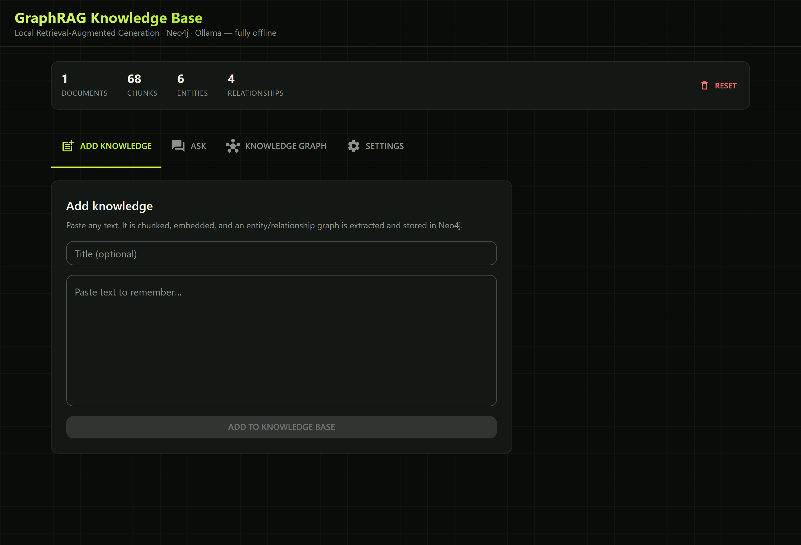
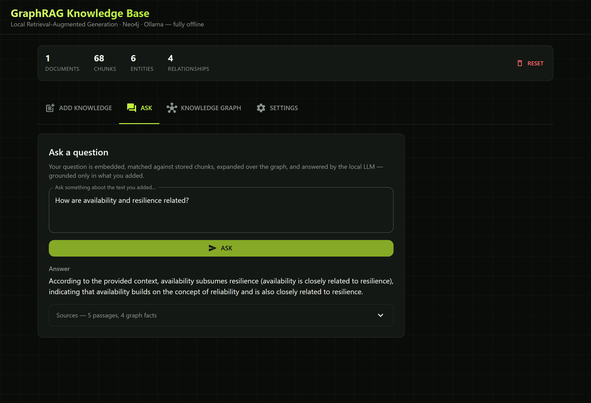
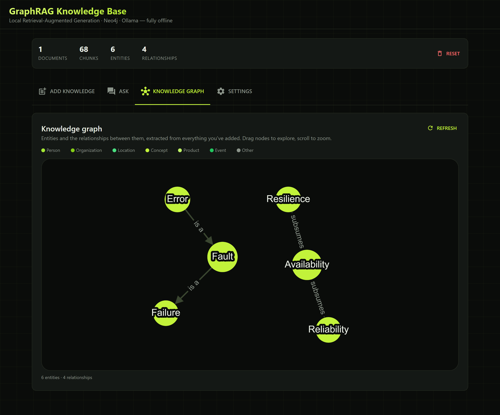
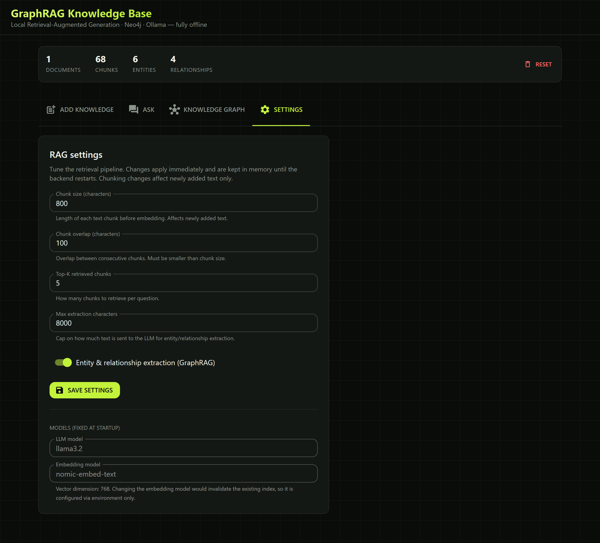

# Local GraphRAG Knowledge Base

A self-hosted, **fully offline** Retrieval-Augmented Generation (RAG) system. Paste text
into the web UI → it's chunked, embedded, and turned into a **knowledge graph** in Neo4j.
Ask questions → get answers from a **local LLM (Ollama)**, grounded only in your data.
Nothing ever leaves your machine.

> **Proof of concept** — the full ingest → graph → retrieve → answer loop, runnable with a
> single `docker compose up`.

```
┌──────────────┐   paste text    ┌─────────────────────────────┐   Cypher    ┌────────────┐
│   React UI   │ ──────────────► │        Flask backend        │ ──────────► │   Neo4j    │
│  MUI + TS    │ ◄────────────── │   (clean architecture)      │ ◄────────── │  graph +   │
└──────────────┘   answer +      │  ingest / retrieve use-cases│   vectors   │  vectors   │
                   sources       └──────────────┬──────────────┘             └────────────┘
                                                │ embeddings + chat
                                                ▼   Ollama (nomic-embed-text · llama3.2)
```

## The app — four tabs

### ＋ Add knowledge
Paste any text — it's chunked, embedded, and an entity/relationship graph is extracted into Neo4j.



### 💬 Ask
Your question is embedded, matched against stored chunks (hybrid vector + keyword), expanded
over the graph, and answered by the local LLM — with expandable **sources** (passages + graph facts).



### ⬡ Knowledge graph
Interactive [Cytoscape](https://js.cytoscape.org/) view of the extracted entities (coloured
by type) and their relationships. Drag nodes, scroll to zoom, refresh after ingesting.



### ⚙ Settings
Live-tune the RAG pipeline — chunk size / overlap, top‑K, max extraction characters, and the
entity-extraction toggle. Changes apply immediately.



## Quick start

```bash
docker compose up --build
```

| Service       | URL                                                       |
|---------------|-----------------------------------------------------------|
| **Web UI**    | http://localhost:3000                                     |
| Neo4j Browser | http://localhost:7474 (`neo4j` / `password123`)           |
| Backend API   | http://localhost:8000/api/health                          |

First run downloads ~2.5 GB of Ollama models — wait for `RAG backend ready.` in the logs,
then open the UI. CPU works; a GPU is much faster (uncomment the `deploy` block for
`ollama` in [docker-compose.yml](docker-compose.yml)).

> **Behind a corporate proxy / antivirus** and the build or model pull fails with SSL
> errors? See [Troubleshooting](#troubleshooting) below.

## How it works

The graph database does double duty. Neo4j stores **chunk embeddings** (a native vector
index) *and* an **entity/relationship graph** — so retrieval is hybrid:

```
ingest:  text → chunk → embed → :Chunk (+vector index)
                              └→ LLM extracts :Entity + [:RELATED_TO], links [:MENTIONS]

query:   question → embed + keywords → hybrid search top-K :Chunk → expand one hop
                         → LLM answers from that (passages + graph facts) context only
```

That one-hop graph expansion is the extra structured context plain vector RAG can't give
you. Full pipeline, Neo4j schema, and the clean-architecture rationale:
**[docs/ARCHITECTURE.md](docs/ARCHITECTURE.md)**.

## Tech stack

| Layer         | Choice                                                       |
|---------------|--------------------------------------------------------------|
| Frontend      | React 18 · TypeScript · Vite · Material UI                   |
| Backend       | Python · Flask — clean architecture / modular monolith       |
| Graph DB      | Neo4j 5 (graph + native vector index)                        |
| LLM & embed   | Ollama (`llama3.2`, `nomic-embed-text`) — open source, local |
| Orchestration | Docker Compose                                               |

<details>
<summary><b>Configuration</b></summary>

Env vars set the **startup defaults** (copy [.env.example](.env.example) to `.env`); the
chunking/retrieval ones are then editable at runtime from the **Settings** tab.

| Variable                       | Default            | Meaning                              |
|--------------------------------|--------------------|--------------------------------------|
| `LLM_MODEL`                    | `llama3.2`         | Ollama chat model                    |
| `EMBEDDING_MODEL`              | `nomic-embed-text` | Ollama embedding model               |
| `EMBEDDING_DIM`                | `768`              | Must match the embedding model       |
| `CHUNK_SIZE` / `CHUNK_OVERLAP` | `800` / `100`      | Chunking window (characters)         |
| `TOP_K`                        | `5`                | Chunks retrieved per question        |
| `ENABLE_ENTITY_EXTRACTION`     | `true`             | Off = plain vector RAG, faster ingest |

> Changing `EMBEDDING_MODEL` changes the vector dimension — update `EMBEDDING_DIM` to match
> and reset the knowledge base; old and new vectors aren't comparable.

</details>

<details>
<summary><b>Troubleshooting</b></summary>

**SSL certificate errors behind a TLS-inspecting proxy.** Your host trusts the proxy's
root CA, but the containers don't. Two phases, fixed separately:

1. **Image build** (pip/npm `CERTIFICATE_VERIFY_FAILED`) → set `INSECURE_TLS=1` in `.env`.
2. **Ollama model pull** (`x509: certificate signed by unknown authority`) → Ollama must
   *trust* the CA. Export your roots into [certs/](certs/):
   ```powershell
   powershell -ExecutionPolicy Bypass -File certs\export-windows-cas.ps1
   ```
   (See [certs/README.md](certs/README.md) for non-Windows.) Then `docker compose up --build`.

On a normal network neither step is needed.

**Backend retries Neo4j on first boot** — expected; Neo4j takes ~30 s to become healthy.

**First question is slow** — the LLM loads into memory on the first call; later calls are
faster (a GPU helps a lot).

</details>

<details>
<summary><b>API reference</b></summary>

| Method | Path             | Body / Query            | Description                       |
|--------|------------------|-------------------------|-----------------------------------|
| GET    | `/api/health`    | —                       | Liveness check                    |
| GET    | `/api/stats`     | —                       | Counts of docs/chunks/entities    |
| GET    | `/api/graph`     | `?limit=N`              | Entities + relationships (graph view) |
| GET    | `/api/settings`  | —                       | Current RAG tuning parameters     |
| PUT    | `/api/settings`  | `{ "chunk_size", ... }` | Update tuning parameters at runtime |
| POST   | `/api/documents` | `{ "text", "title?" }`  | Ingest text into the graph        |
| POST   | `/api/query`     | `{ "question" }`        | Ask a question, get a grounded answer |
| POST   | `/api/reset`     | —                       | Wipe all stored knowledge         |

</details>

<details>
<summary><b>Project structure & local development</b></summary>

```
.
├── docker-compose.yml      # Neo4j + Ollama + backend + frontend
├── backend/app/            # Flask, clean architecture
│   ├── domain/             #   models + ports (no framework deps)
│   ├── application/        #   use cases: ingest_text, answer_question
│   ├── infrastructure/     #   adapters: ollama/, neo4j/
│   ├── api/                #   Flask blueprints
│   ├── settings.py         #   runtime-adjustable RAG params
│   └── container.py        #   dependency-injection wiring
└── frontend/src/           # React + TypeScript (Vite, MUI)
    ├── api/                #   typed API client
    └── components/         #   IngestPanel, QueryPanel, GraphView, SettingsPanel, …
```

Run without Docker (needs Neo4j + Ollama, e.g. `docker compose up neo4j ollama ollama-init`):

```bash
# backend
cd backend && pip install -r requirements-dev.txt
NEO4J_URI=bolt://localhost:7687 OLLAMA_BASE_URL=http://localhost:11434 python wsgi.py
pytest

# frontend (proxies /api to :8000)
cd frontend && npm install && npm run dev
```

</details>

## Roadmap

Baseline GraphRAG + entity extraction is done. Next, in order of value:

- [x] **Graph visualisation** in the UI (interactive Cytoscape view).
- [x] **Hybrid search** — union the vector and full-text indexes.
- [ ] **Text2Cypher** — route counting/aggregation questions to generated Cypher.
- [ ] **Entity resolution** — merge duplicates ("ACME" / "ACME Ltd").
- [ ] **Community summaries** (Microsoft-style GraphRAG) for broad corpus questions.

## License

MIT — see [LICENSE](LICENSE).
